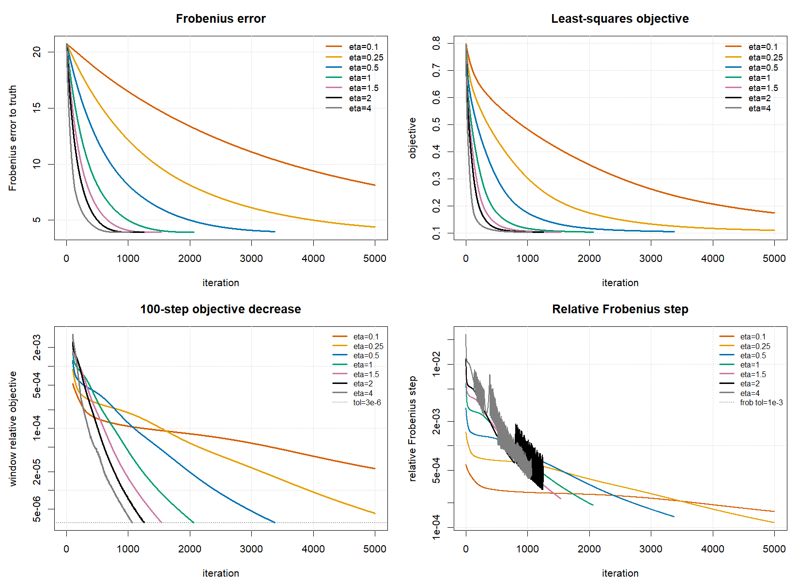

# ScaledGD 收敛诊断实验

这个仓库整理了围绕 Scaled Gradient Descent, 即 ScaledGD, 初始化方法的一组诊断实验。重点不是比较所有估计方法，而是集中讨论 ScaledGD 本身的迭代表现：

- 原始 objective-change 停止规则是否会过早停止
- 是否应该加入相邻两步矩阵 Frobenius movement
- `scaledgd-stop-window` 应该如何解释和使用
- 移动窗口平均是否能判断目标函数仍在下降
- 步长 `eta` 变小或变大对收敛速度和最终误差的影响

## 项目结构

```text
scripts/
  test_scaledgd_initial_convergence.R
  main_simulation_scaledgd_window_stop.R

tables/
  baseline_m200_scaledgd_summary.csv
  p30_q25_covscale02_m500_eta_summary.csv

figures/
  fig_scaledgd_window100_m200.png
  fig_scaledgd_eta1_window100_m500.png
  fig_scaledgd_eta_comparison.png

docs/
  window_stop_and_stepsize_notes.md

results/
  baseline_rank2_m200/
  p30_q25_covscale02_m500/
```

其中 `results/` 保存每组实验的原始 `config.txt`、逐步迭代历史 CSV、summary CSV 和图。`tables/` 是整理后的核心对照表。

## 实验一：默认维度下的停止规则诊断

默认诊断设置为：

```text
p = 10, q = 10, rank = 2
sample-size = 200
sigma = 0.5
signal = 6.0,4.4
design = kronecker
cov-scale = 1
```

这个实验用于观察原始 objective stopping、单步 Frobenius stopping、连续若干步 stopping 和 moving-window stopping 的差异。

主要现象：

- 原始 objective-change 规则在第 444 步停止，`||M-M0||_F = 1.097`。
- 单步 Frobenius 规则 `frob_tol=1e-3` 在第 289 步停止，`||M-M0||_F = 1.819`，明显过早。
- 连续 10 步 Frobenius movement 都小再停，可以推迟到第 431 步，误差改善到 `1.141`。
- moving-window 规则配合 `maxit=1000, window=100, tol=3e-6`，在第 996 步停止，`||M-M0||_F = 0.511`，接近 2000 步参考解的 `0.510`。

对应汇总表：

```text
tables/baseline_m200_scaledgd_summary.csv
```

## 实验二：p=30, q=25, cov-scale=0.2, sample-size=500

第二组实验使用更高维、整体设计强度更小的设置：

```text
p = 30, q = 25, rank = 2
sample-size = 500
cov-scale = 0.2
scaledgd-stop-rule = window
scaledgd-stop-window = 100
scaledgd-tol = 3e-6
scaledgd-frob-tol = 1e-3
```

该实验重点观察步长 `eta` 对收敛速度和最终 Frobenius error 的影响。

核心结果：

| eta | iter | converged | `||M-M0||_F` | adjusted minimax ratio | backtrack_total |
|---:|---:|---|---:|---:|---:|
| 0.1 | 5000 | FALSE | 8.127 | 6.93 | 0 |
| 0.25 | 5000 | FALSE | 4.389 | 3.74 | 0 |
| 0.5 | 3378 | TRUE | 3.972 | 3.39 | 0 |
| 1.0 | 2060 | TRUE | 3.911 | 3.34 | 0 |
| 1.5 | 1540 | TRUE | 3.926 | 3.35 | 0 |
| 2.0 | 1254 | TRUE | 3.945 | 3.36 | 42 |
| 4.0 | 1064 | TRUE | 3.961 | 3.38 | 890 |

这组实验中，步长太小主要导致收敛变慢；步长继续增大可以减少迭代次数，但 `eta=2` 和 `eta=4` 开始触发明显 backtracking，最终 Frobenius error 没有优于 `eta=1`。综合看，`eta=1` 或 `eta=1.5` 是更稳妥的选择。

对应汇总表：

```text
tables/p30_q25_covscale02_m500_eta_summary.csv
```

步长比较图：



## Moving-Window 停止规则

为了避免单步目标函数变化或单步 Frobenius movement 的偶然波动，实验中加入了 moving-window 停止规则。设窗口长度为 `W`，在第 `k` 步计算：

```text
window_rel_objective =
  (obj_{k-W} - obj_k) / ((1 + abs(obj_{k-W})) * W)

window_rel_frob =
  mean(||M_j - M_{j-1}||_F / (1 + ||M_{j-1}||_F), j = k-W+1,...,k)
```

只有两个量都低于阈值时才停止：

```text
window_rel_objective < scaledgd_tol
window_rel_frob      < scaledgd_frob_tol
```

这个规则不使用真实矩阵 `M0`，所以可以用于正式 simulation，而不只是用于诊断图。

## 复现命令

默认维度 moving-window 诊断：

```powershell
Rscript scripts/test_scaledgd_initial_convergence.R `
  --scaledgd-stop-rule=window `
  --scaledgd-stop-window=100 `
  --scaledgd-maxit=1000 `
  --scaledgd-tol=3e-6 `
  --scaledgd-frob-tol=1e-3 `
  --out-root=results_reproduced/baseline_window100_tol3e6
```

`p=30, q=25, cov-scale=0.2, sample-size=500` 下的推荐步长诊断：

```powershell
Rscript scripts/test_scaledgd_initial_convergence.R `
  --p=30 `
  --q=25 `
  --sample-size=500 `
  --cov-scale=0.2 `
  --scaledgd-eta=1 `
  --scaledgd-stop-rule=window `
  --scaledgd-stop-window=100 `
  --scaledgd-maxit=5000 `
  --scaledgd-tol=3e-6 `
  --scaledgd-frob-tol=1e-3 `
  --out-root=results_reproduced/p30_q25_covscale02_m500_eta1
```

## 关于 minimax rate 的说明

脚本中的标准 rate 为：

```text
sigma * sqrt(rank * (p + q) / sample_size)
```

当 `cov-scale=0.2` 同时乘到 `Sigma_p` 和 `Sigma_q` 时，设计矩阵整体强度约按 `0.2` 缩小。因此在解释 `p=30,q=25,cov-scale=0.2` 的误差时，表格同时给出一个启发式的 cov-scale adjusted ratio，即将标准 rate 除以 `cov-scale` 后再比较。

## 参考文献

1. Tian Tong, Cong Ma, Yuejie Chi. [Accelerating Ill-Conditioned Low-Rank Matrix Estimation via Scaled Gradient Descent](https://www.jmlr.org/papers/v22/20-1067.html). Journal of Machine Learning Research, 22(150):1-63, 2021.
2. Zhenxuan Li, Meng Huang. [Scaled Gradient Descent for Ill-Conditioned Low-Rank Matrix Recovery with Optimal Sampling Complexity](https://arxiv.org/abs/2604.00060). arXiv:2604.00060, 2026.
3. Stephen Tu, Ross Boczar, Max Simchowitz, Mahdi Soltanolkotabi, Benjamin Recht. [Low-rank Solutions of Linear Matrix Equations via Procrustes Flow](https://proceedings.mlr.press/v48/tu16.html). ICML, 2016.

